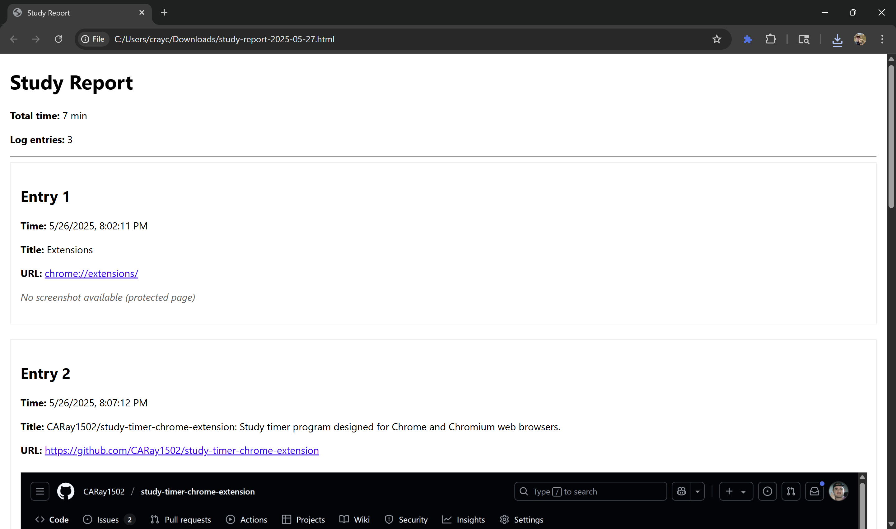
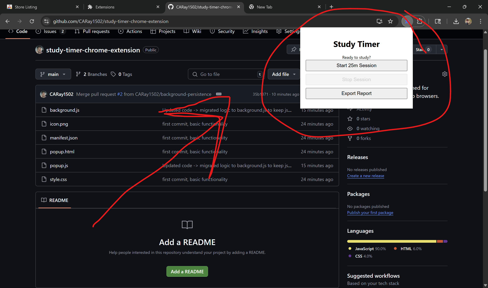

# Study Timer with Accountability ⏱️

> **Chrome Extension · Manifest V3 · Privacy-first**  
> Build & ship in minutes – proof-of-focus for students & professionals.

---

## 🚀 Project at a Glance

| What | Why it matters to you (recruiter) |
|------|-----------------------------------|
| **MV3 Chrome Extension** | Shows comfort with modern browser APIs, service-worker background scripts, and tight permission scopes. |
| **Periodic Screenshots & Tab Logs** | Demonstrates real-world handling of sensitive data, UI feedback loops, and local storage performance. |
| **Exportable HTML Report** | Highlights JS Blob/File APIs, client-side generation, and UX polish. |
| **100% Local-only Data** | Exhibits privacy-conscious architecture & clear user communication. |

---

## ✨ Key Features

- **One-click Pomodoro** — default 25-minute focus sessions (configurable).
- **5-minute Proof Shots** — captures the active tab every 5 minutes and logs title, URL, and timestamp.
- **Instant Report Export** — generates a self-contained HTML file with all screenshots embedded.
- **Zero Backend** — everything runs in the browser; nothing leaves the user’s device.

---

## 🖼️ Screenshots

| Popup Timer | Exported Report |
|-------------|-----------------|
|  |  |

---

## 🔒 Privacy in Plain English

This extension **never touches a server**. Screenshots and tab history are:

1. **Captured locally** via `chrome.tabs.captureVisibleTab()` only while a session is active.
2. **Stored in `chrome.storage.local`** (sandboxed to the browser).
3. **Bundled into an HTML file** when the user clicks *Export* and **immediately erased** from storage.

**No analytics. No third-party scripts. No network requests. Just client-side JavaScript.**

---

## 🛠 Tech Highlights

- Manifest V3, Service-Worker background
- Tabs, Storage, ActiveTab, and Downloads permissions (minimum viable scope)
- Vanilla JS + HTML/CSS, no frameworks
- ES6 modules, async/await, Blob API

---

## ▶️ Run Locally in 10 Seconds

chrome://extensions → Enable Developer mode → Load unpacked → select project folder
chrome extension should populate to your extensions and you can begin using it. 
make sure to pin it! 

Start a session, take a break for 5 minutes, export the report when finished – you’re done.

---

## 📫 Let’s Connect

**Christian** · [My website](https://www.christianray.me) · christianray.me
**Socials** · [@chris.is.coding](https://www.instagram.com/chris.is.coding) · @chris.is.coding

*Open-sourced for demonstration & learning purposes.*
